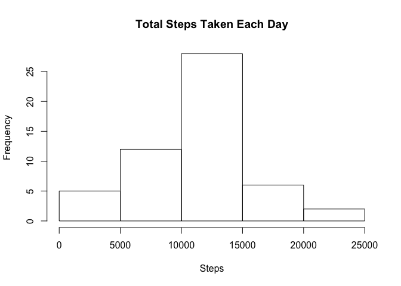
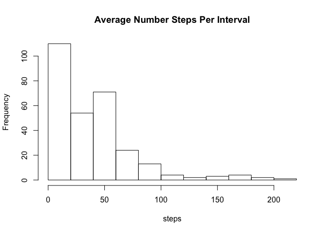
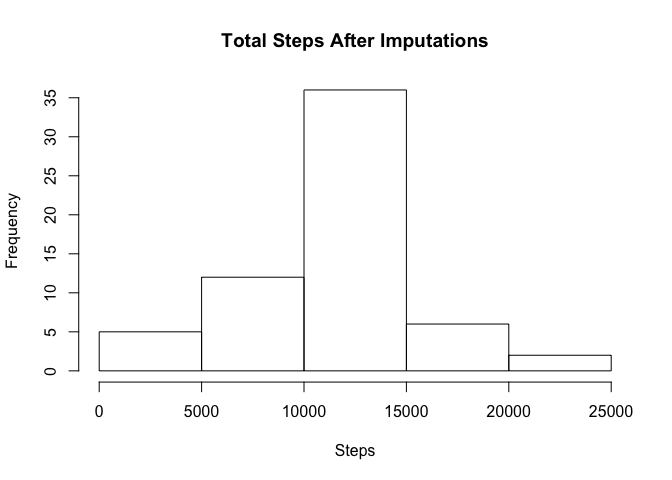
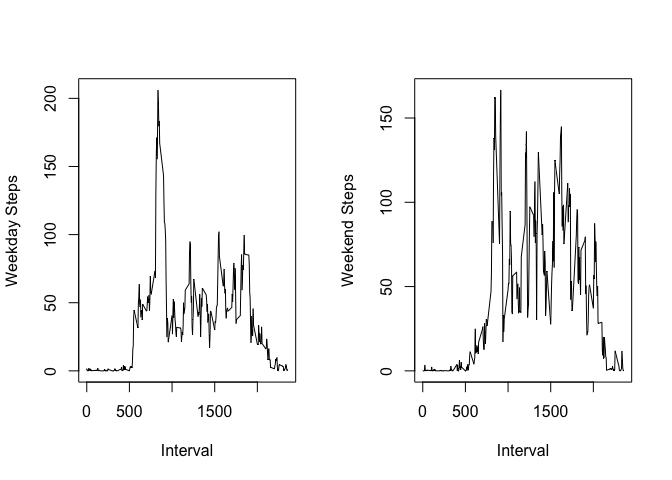

Project 1 - Reproducible Research
================

### 1. Code for reading in the dataset and/or processing the data

``` r
folder_location <-"/Users/ethanschein/r-programming/RepData_PeerAssessment1"
setwd(folder_location)
unzip(zipfile = paste(folder_location, "/", 'activity.zip', sep = ""))
activity_DS <-read.csv(file = 'activity.csv', header = T)
activity_DS$date <- as.Date(x = activity_DS$date, "%Y-%m-%d" )
```

    ## Warning in strptime(x, format, tz = "GMT"): unknown timezone 'zone/tz/
    ## 2018e.1.0/zoneinfo/America/New_York'

``` r
good_act <- activity_DS[complete.cases(activity_DS), ]
```

### 2. Histogram of the total number of steps taken each day

``` r
dta.sum <- aggregate(x = good_act['steps'], FUN = sum, by = list(Group.date = good_act$date))
hist(dta.sum$steps, main = "Total Steps Taken Each Day", xlab = 'Steps')
```



### 3. Mean and median number of steps taken each day

``` r
print(round(mean(dta.sum$steps)))
```

    ## [1] 10766

``` r
print(round(median(dta.sum$steps)))
```

    ## [1] 10765

### 4. Time series plot of the average number of steps taken per interval

``` r
interval <- aggregate(good_act['steps'], by = list(good_act$interval), FUN = mean)
hist(interval$steps, main = "Average Number Steps Per Interval", xlab = "steps" )
```



### 5. The 5-minute interval that, on average, contains the maximum number of steps

``` r
print(interval[which.max(interval$steps),]) 
```

    ##     Group.1    steps
    ## 104     835 206.1698

### 6. Code to describe and show a strategy for imputing missing data

``` r
for(i in 1:length(activity_DS$steps)){
        if(is.na(activity_DS$steps)[i]){
         row <- activity_DS[i,]
         int <- row[,which(colnames(row)=='interval')]
         impute <- mean(activity_DS[which(activity_DS$interval==int),]$steps, na.rm = T)
         activity_DS[i,which(colnames(activity_DS)=='steps')] <- impute
        }
}
print(which(is.na(activity_DS$steps)))
```

    ## integer(0)

### 7. Histogram of the total number of steps taken each day after missing values are imputed

``` r
dta.sum2 <- aggregate(x = activity_DS['steps'], FUN = sum, by = list(Group.date = activity_DS$date))
hist(dta.sum2$steps, main = "Total Steps After Imputations", xlab = 'Steps')
```



### 8. Panel plot comparing the average number of steps taken per 5-minute interval across weekdays and weekends

``` r
        index1 <- which(weekdays(activity_DS$date)=="Saturday" | weekdays(activity_DS$date)=='Sunday')
        DS_weekend <- activity_DS[index1,]
        DS_weekday <-activity_DS[activity_DS!=index1,]
        
        DS_weekday_agg <- aggregate(x = DS_weekday['steps'], FUN = mean, by = list(DS_weekday$interval))
        DS_weekend_agg <- aggregate(x = DS_weekend['steps'], FUN = mean, by = list(DS_weekend$interval))

        par(mfrow=c(1,2))
        plot(x = DS_weekday_agg$Group.1, y = DS_weekday_agg$steps, type = "l", xlab = 'Interval', ylab = 'Weekday Steps')
        plot(x = DS_weekend_agg$Group.1, y = DS_weekend_agg$steps, type = "l", xlab = 'Interval', ylab = 'Weekend Steps')
```


